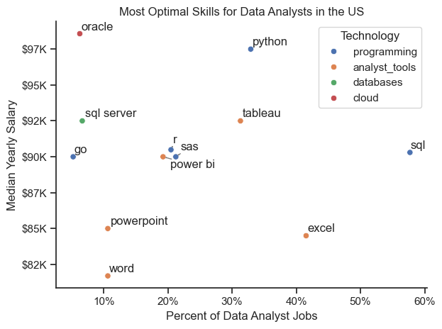
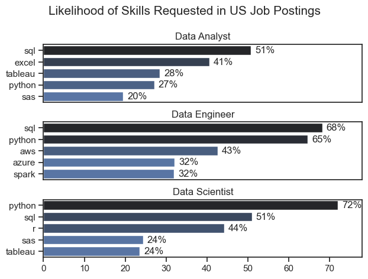
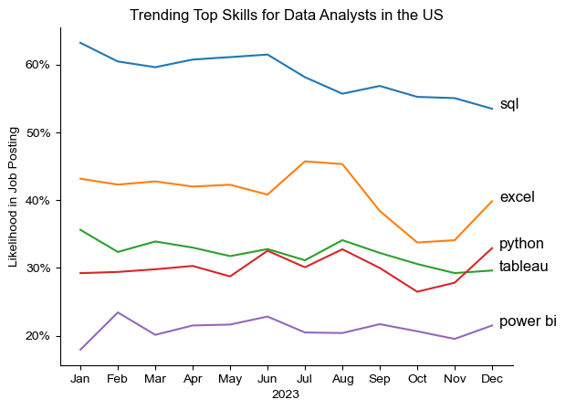
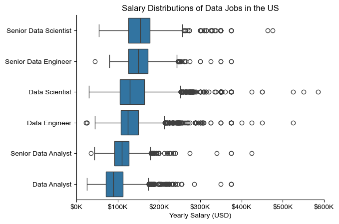
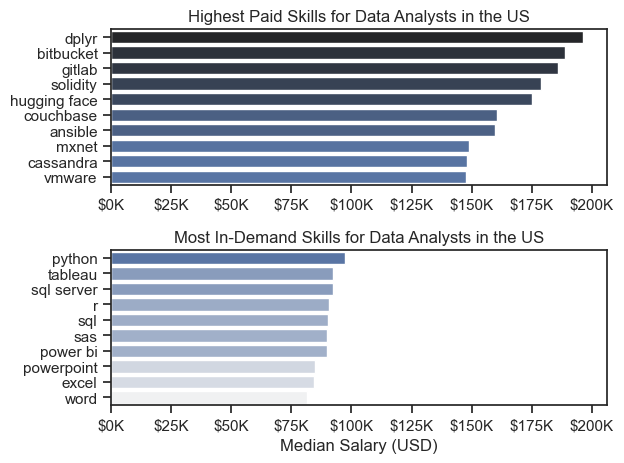

# 📊 Data Job Market Analysis: What Skills Should a Data Analyst Learn?

**Exploratory analysis of ~785,000 real 2023 data-job postings** to find which skills are most in demand, how they're trending, and which ones pay best. The focus is on Data Analyst roles in the US.

`Python` · `pandas` · `matplotlib` · `seaborn` · `Jupyter` · Hugging Face `datasets`

> Built as the capstone project of Luke Barousse's [Python for Data Analytics](https://www.youtube.com/watch?v=wUSDVGivd-8) course, using his public [data_jobs](https://huggingface.co/datasets/lukebarousse/data_jobs) dataset.



## Key findings

1. **SQL is the one skill to have.** It appears in **~58% of US Data Analyst postings**, far more than any other skill, with a median salary around $90K.
2. **Python and Tableau are the best next step.** Each appears in about a third of postings, and both pay more than SQL: Python ~$97K and Tableau ~$92K median.
3. **Office tools pay least.** Excel is widely requested (~42%), but Excel, PowerPoint and Word come with the lowest medians ($81–85K).
4. **Data Analyst is the entry point on salary.** It has the lowest median of the six main data roles, and senior and scientist/engineer roles pay noticeably more.

## The questions, answered

### 1. What skills do the three most popular data roles ask for?


SQL is in the top two for all three roles. Python dominates Data Scientist postings (72%), and cloud and big-data tools (AWS, Azure, Spark) set Data Engineers apart.

### 2. How did demand for Data Analyst skills trend through 2023?


SQL stayed on top all year but slipped from ~63% to ~53% of postings. Excel dipped in the autumn and recovered, and Python finished the year ahead of Tableau.

### 3. How well do data jobs and skills pay?



The highest-paid skills are niche (dplyr, Bitbucket, GitLab) and rarely requested. Among the skills employers ask for most, Python pays best.

## How it was done

| Notebook | What it covers |
|---|---|
| [1_EDA_Intro](notebooks/1_EDA_Intro.ipynb) | First look at the dataset: roles, countries, companies, job perks |
| [2_Skill_Demand](notebooks/2_Skill_Demand.ipynb) | Splitting out skill lists and counting skills per role, then converting to % of postings |
| [3_Skills_Trend](notebooks/3_Skills_Trend.ipynb) | Monthly pivot table of skill demand, shown as a share of postings |
| [4_Salary_Analysis](notebooks/4_Salary_Analysis.ipynb) | Salary distributions (box plots) and median salary per skill |
| [5_Optimal_Skills](notebooks/5_Optimal_Skills.ipynb) | Demand vs pay scatter plot, coloured by technology type |

**Techniques used:** parsing text into lists with `ast.literal_eval`, `explode`, `groupby` and aggregation, pivot tables, turning counts into percentages so groups of different sizes can be compared, and labelled charts in matplotlib and seaborn (`adjustText` for readable labels).

## Run it yourself

```bash
pip install pandas matplotlib seaborn datasets adjustText
jupyter lab
```

Each notebook downloads the dataset from Hugging Face when it runs, so there's nothing to set up beforehand.
